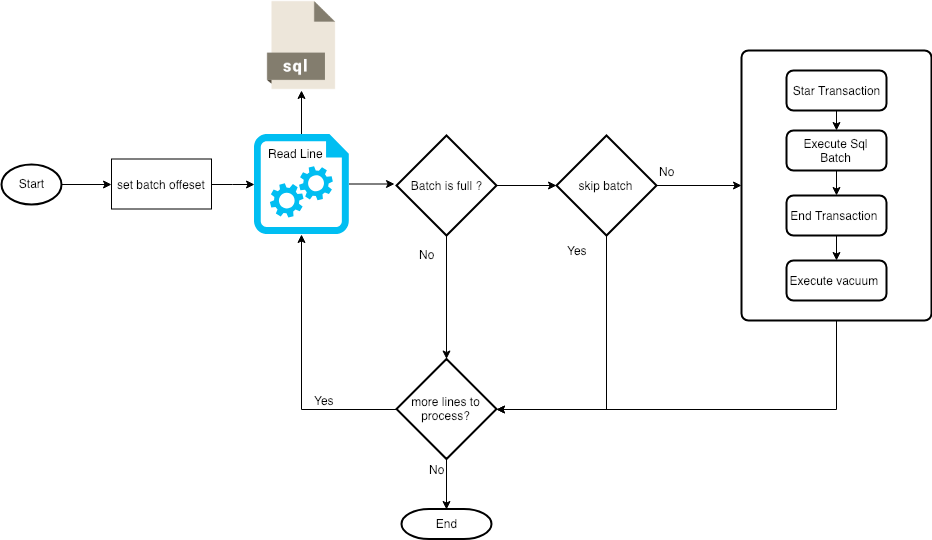
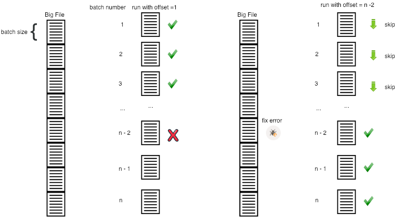

# pg-batch-executor [](https://travis-ci.org/glistman/pg-batch-executor)
Allows to execute a very large file of insert update and delete in small batch, does not handle a transaction per file if not by batch, the size of the batch is defined by the user, allowing to start manually in the last batch executed correctly.


## why could a batch be skipped?

if the number of the current batch is less than the "offset" the batch is skipped.
In what case is it useful?


## Why do vacuum?
when the data is updated or deleted in Postgres, the tables are bloat as they generate dead tuples (see postgres MVCC), so query performance will decrease, so we recommend doing a vacuum after executing a batch, especially if it is running in a production environment and is active for users

"VACUUM reclaims storage occupied by dead tuples. In normal PostgreSQL operation, tuples that are deleted or obsoleted by an update are not physically removed from their table; they remain present until a VACUUM is done. Therefore it's necessary to do VACUUM periodically, especially on frequently-updated tables."
[from https://www.postgresql.org/docs/9.6/sql-vacuum.html]

## Config
  ```
  export DB_HOST=localhost
  export DB_PORT=5432
  export DB_NAME=test
  export DB_USER=postgres
  export DB_PASSWORD=postgres
  export BATCH_OFFSET=1
  export BATCH_SIZE=10000
  export SCRIPT_PATH=/home/ubuntu/update_users.sql
  export TABLES_TO_VACUUM=users,addresses
  ```
  
 the parameter BATCH_OFFSET is used in case of failure of a batch to be able to correct the file and start in the batch that failed

## Run
```
./sbt run
```